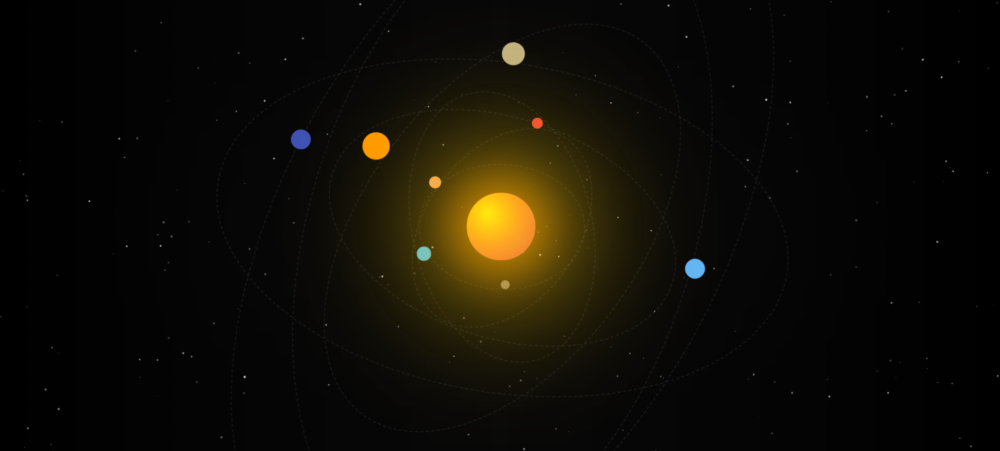

# FunSolarSystem

Welcome to **FunSolarSystem**! 🚀

This is a just a fun animated solar system background built with HTML, CSS, JavaScript, and GSAP.  

---

## How to Use

1. Clone or download this repo.  
2. Open `index.html` in your favorite browser.  
3. Enjoy the moving solar system!

---

## Screenshot

  

---

## Technologies Used

- HTML5  
- CSS3  
- JavaScript (ES6)  
- [GSAP](https://greensock.com/gsap/) for animations  

Made with 🌟 for fun by saisha karki.
